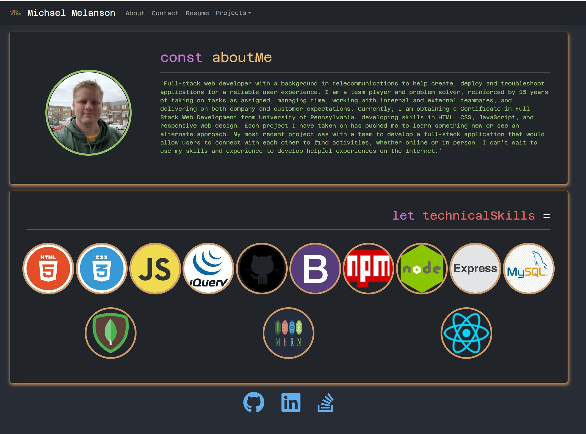
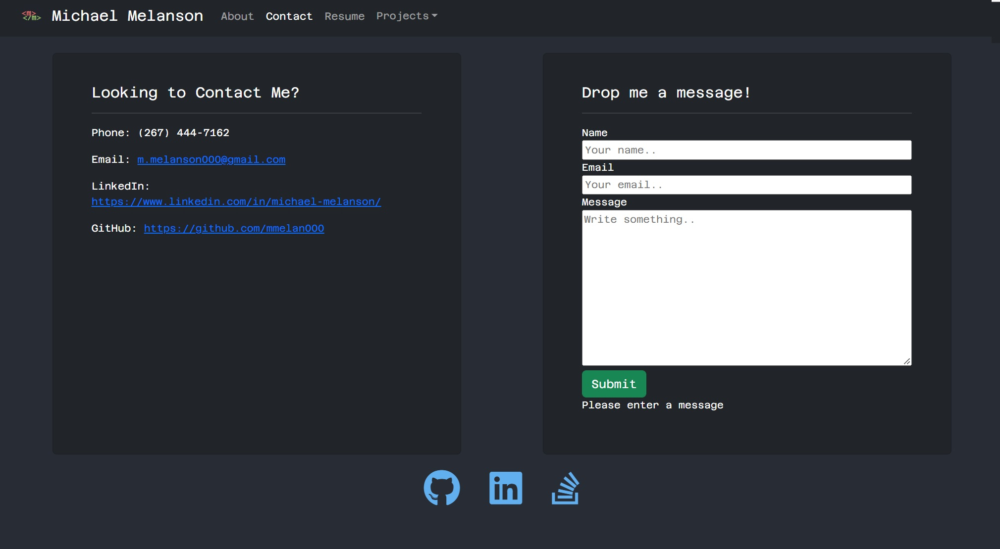
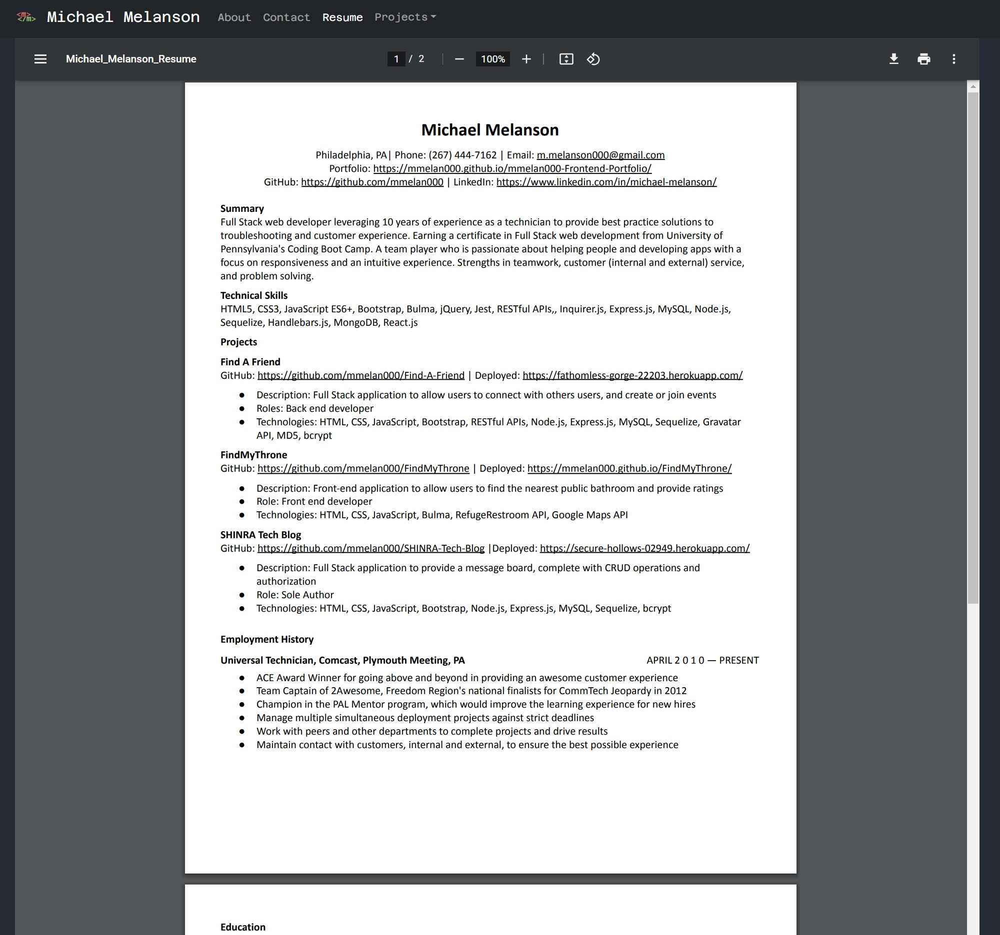
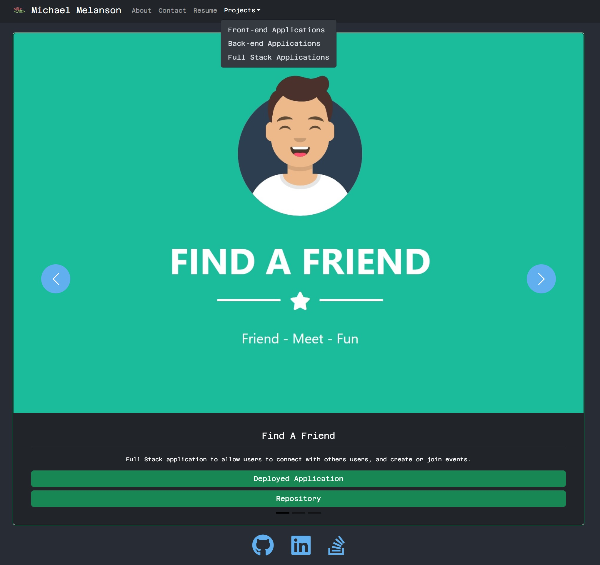

# 20 React: React Portfolio

[](https://opensource.org/licenses/MIT)

## Description

The objective of this challenge is create a portfolio using React.js

**User Story**

```
AS AN employer looking for candidates with experience building single-page applications
I WANT to view a potential employee's deployed React portfolio of work samples
SO THAT I can assess whether they're a good candidate for an open position
```

**Acceptance Criteria**

```
GIVEN a single-page application portfolio for a web developer
WHEN I load the portfolio
THEN I am presented with a page containing a header, a section for content, and a footer
WHEN I view the header
THEN I am presented with the developer's name and navigation with titles corresponding to different sections of the portfolio
WHEN I view the navigation titles
THEN I am presented with the titles About Me, Portfolio, Contact, and Resume, and the title corresponding to the current section is highlighted
WHEN I click on a navigation title
THEN I am presented with the corresponding section below the navigation without the page reloading and that title is highlighted
WHEN I load the portfolio the first time
THEN the About Me title and section are selected by default
WHEN I am presented with the About Me section
THEN I see a recent photo or avatar of the developer and a short bio about them
WHEN I am presented with the Portfolio section
THEN I see titled images of six of the developer’s applications with links to both the deployed applications and the corresponding GitHub repositories
WHEN I am presented with the Contact section
THEN I see a contact form with fields for a name, an email address, and a message
WHEN I move my cursor out of one of the form fields without entering text
THEN I receive a notification that this field is required
WHEN I enter text into the email address field
THEN I receive a notification if I have entered an invalid email address
WHEN I am presented with the Resume section
THEN I see a link to a downloadable resume and a list of the developer’s proficiencies
WHEN I view the footer
THEN I am presented with text or icon links to the developer’s GitHub and LinkedIn profiles, and their profile on a third platform (Stack Overflow, Twitter)
```

## Table of Contents

1. [Description](#description)
2. [Deployment](#deployment)
3. [Contributing](#contributing)
4. [Questions](#questions)
5. [License](#license)

## Deployment

[Deployed Website](https://mmelan000.github.io/mmelan000-Frontend-Portfolio/)






## Optimizations

- Content is built on concept of mobile first.
- Desisgned projects that scale based on viewport while also maintaining the AC.
- Refactored code after discovering the inherit property and research into the logic being @media screen.
- List of variables in root so that elements can be adjusted on the fly and can adjust root with different viewport sizes instead of rewiting redunant code.

## Contributing

Follow best practices for naming conventions, indentation, quality comments, etc.

## Questions

If you have any questions, please reach out to me either on Github or by Email.

- **Github:** [mmelan000](https://github.com/mmelan000)
- **Email:** [m.melanson000@gmail.com](mailto:m.melanson000@gmail.com)

## License

- [MIT](https://opensource.org/licenses/MIT)
